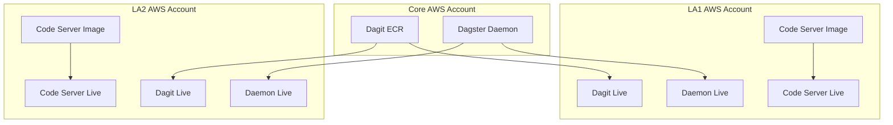

# Dagster
This is the docker images used in production for Dagster. 

## How to Run Locally
Make sure you have [docker](http://www.docker.io) installed. 

You'll need to copy the `.env.sample` file to `.env` and make sure you set the correct values

Then run the following commands:

1. docker compose build - This will build the images based on the instructions in the docker files
2. docker compose up - This will run the docker files generated in step 1 and connect them as per the 
instructions in the `docker-0compose.yaml` file. 

## How it works
The current design is spin up several images as follows:

### Dagit
This is the web interface for Dagster that allows for viewing and interacting with Dagster objects. More 
[info here](https://docs.dagster.io/concepts/dagit/dagit)
### Dagster Daemon
Determines what needs to be run and when using schedulers, sensors, etc. More 
[info here](https://docs.dagster.io/deployment/dagster-daemon)
### User Code Server
This contains the pipeline code for Dagster to run. This includes sensors, ops, assets, jobs, 
schedule definitions, etc. More 
[info here](https://docs.dagster.io/concepts/code-locations/workspace-files#running-your-own-grpc-server)

