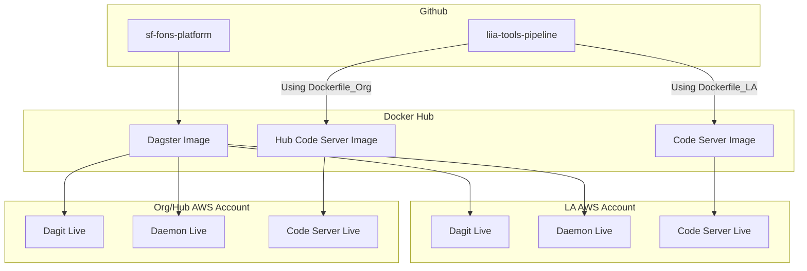

# Dagster
This is the docker images used in production for Dagster. 

## How to Run Locally
Make sure you have [docker](http://www.docker.io) installed. 

You'll need to copy the `.env.sample` file to `.env` and make sure you set the correct values

Then run the following commands:

1. docker compose build - This will build the images based on the instructions in the docker files
2. docker compose up - This will run the docker files generated in step 1 and connect them as per the 
instructions in the `docker-compose.yaml` file. 

## How it works
The current design is spin up several images as follows:




### Dagit
This is the web interface for Dagster that allows for viewing and interacting with Dagster objects. 
This is built and pushed to docker hub for use with the wider platform. More 
[info here](https://docs.dagster.io/concepts/dagit/dagit)
### Dagster Daemon
Determines what needs to be run and when using schedulers, sensors, etc. This is built and pushed to 
docker hub for use with the wider platform. More 
[info here](https://docs.dagster.io/deployment/dagster-daemon)
### User Code Server
This contains the pipeline code for Dagster to run. This includes sensors, ops, assets, jobs, 
schedule definitions, etc. The one used in this repo is for demo purposes only and isn't part of 
any wider build or running of the platform.

Code servers can be a way to isolate environments and multiple can exist in an implementation. For instance, 
if you have multiple pipelines that each require different versions of python libraries, 
you could put them into separate code servers.

A code server is defined using `workspace.yaml` Inside, you will see instructions such as this:
```yaml
  - grpc_server:
      host: user_code
      port: 4000
      location_name: "user_code"
```

You could create multiple code servers like this:
```yaml
  - grpc_server:
      host: user_code
      port: 4000
      location_name: "user_code"
  - grpc_server:
      host: user_code2
      port: 4001
      location_name: "user_code2"
```

The dagster implementation will look for images running on that
port with that name to send instructions to. The rest of the
configuration of dagster is contained in the `dagster.yaml` file. Note, if you
do this with multiple code servers, you'll also need to make sure the 
needed ports are allowed to communicate in the network, and the needed
container is defined in the ECS task as well.

More info about the GRPC Server and the Workspace.yaml file is 
[here](https://docs.dagster.io/concepts/code-locations/workspace-files#running-your-own-grpc-server)

## Dagster.yaml

The dagster file contains instructions on how to run Dagster. 
Instructions on how to edit this file are on the [Dagster
website](https://docs.dagster.io/guides/deploy/dagster-yaml)