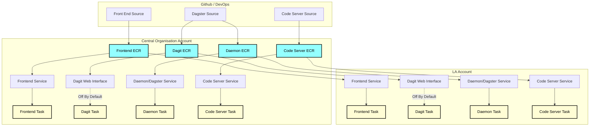
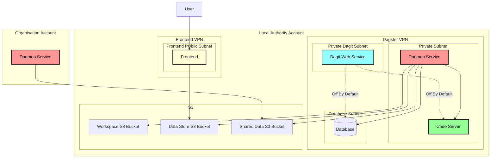

# Deployment Structure
The service is deployed in several stages. 
1. the code is defined in github or another code version control system
2. The code is then pushed to an ECR repository
3. With each ECS service defined, it the task definition is set to pull from the ECR repository and run the service
4. Each account has its own pipeline setup that runs independently of each other

## The Services
Since each account's services are replicated, we can focus in on one of 
them to show the relationship of the different parts of the infrastructure.

How the service works is:
1. The user uploads files to the Frontend which then places them into the Data Store S3 Bucket
2. The Daster service picks up the file and runs it though the pipeline
3. In Intermediate stages, the file is stored in the "Workspace" S3 Folder
4. The final result of the processing is saved back into the data store with files stored in the shared bucket that 
will be accessible to the central organisation as needed.

The dagit service is a web interface used to view and manage schedules, but is turned
off by default. Long-term this will only be accessible via a secure channel such as VPN and used for
troubleshooting purposes. Even then, it will be off by default and need to be manually 
turned on.

The organisation account largely mirrors the one shown here, but I only mention the Daemon Service
to show how the two organisations connect.

## Cross-Account Security
Security is handle via IAM roles and an AWS organisation structure. All accounts
are members of an "organisational unit", and as such communication
between them is restricted to only accounts that are part of that organisation AND
if the user has the required role that allows communication between the accounts.

There are two locations where this is important:
### ECR
ECS Tasks are given permission to access the ECR Repository on the
central account. This is so that a central location can be managed to 
handle the code for the tasks.

### S3
The "Shared" bucket is set so that a local authority can store files it wants
to share with the central organisation. Only files stored here will be accessible
by the organisation and not the other buckets (e.g. workspace and data store). Permission
to this bucket can be revoked by the local authority.

