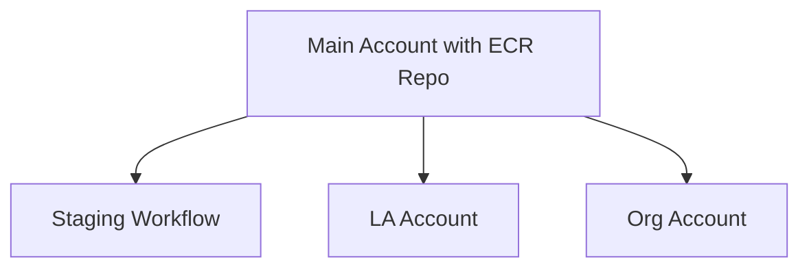
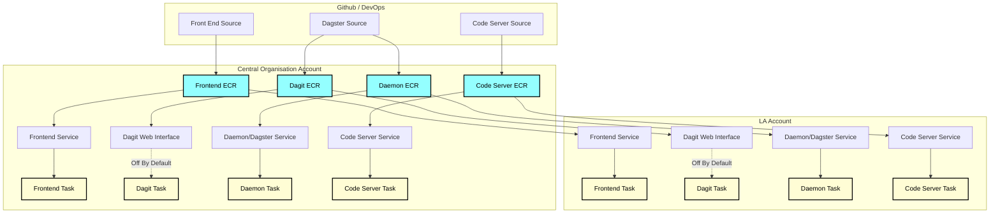
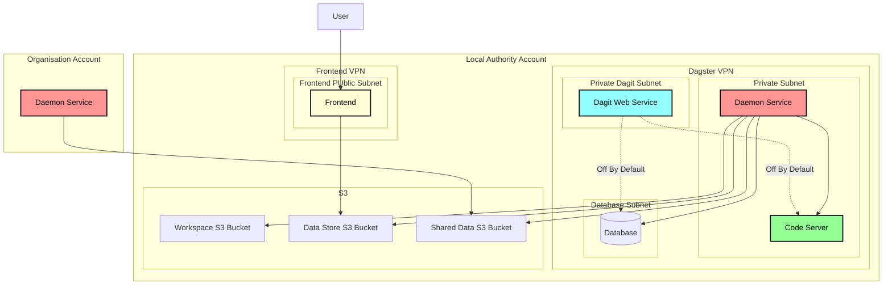

# Infrastructure for Data Platform

The terraform in this directory deploys the SFDATA platform. Currently this is setup for AWS's infrastructure

# Environments
## Development 
Development is expected to take place locally, and not necessarily using the code located here. No infrastructure is 
required. To do this, you can either run `dagster dev -f my_pipeline.py` or go 
to the dagster root directory and run the docker compose setup there.  See 
[here](https://docs.dagster.io/guides/running-dagster-locally) for more info about how to 
develop with dagster.

## Child 
Uses the configuration in the child environment (./environments/child). This is for the standard organisation to use
such as a local authority. It contains the basics needed to run the platform

## Core
Uses the configuration in the stage environment in (./environments/core). This is for the regional organisation to run. 
Connects to the child accounts defined above. Potentially, this can also contain the ECR repositories
that are used across all environments (e.g. Dagster Daemon and Dagit interfaces) and potentially the frontend
of the application itself might be stored here as well (To be determined).

# Components
## ECR
This is where the docker compose setup in the dagster root directory is pushed to. These image repositories
are where the system will pull live images through to subordinate setups. 

The idea is to connect all sub accounts to the main one using "organisations" something like this.

Note: This ISN'T how the infrastructure is currently setup, but that's the goal long-term.

## ECS
Each instance of dagster will run on an ECS task, by default using FARGATE which are spare capacity 
that is sold at a cheaper rate to keep costs down (can be scaled down to zero when not in use). 
As a lot of these pipelines will not be needed often, the idea is to scale down to minimum 
whenever possible and only scale up when needed. Load balancing, etc, is used. The idea, however, 
is that the interface is restricted so that no one can access without using VPN tunnelling. This may 
be removed from the live system to protect data.

## RDS
The database backing Dagster. Defaults to Aurora, but could be changed to others if needed but may have knock-on
effects. Uses Aurora serverless in order to keep costs down using auto scaling. Serverless has the potential to
scale lower than other RDS types. If costs go to high, can switch to a different type as needed.

## S3
S3 buckets will be used for ingress and egress of data. 

# Deployment Steps
## Standard Deployment
1. Load `ecr.yaml` into cloudformation 
2. Create the ECR Repositories
3. Push the correct images [to the ECR Repositories](https://docs.aws.amazon.com/AmazonECR/latest/userguide/docker-push-ecr-image.html)
4. Load `s3.yaml` into cloudformation which should handle the s3 buckets
5. Load `vpc.yaml` into cloudformation
6. Make note of the output values to be used in the next step
7. Load `dagster.yaml` into Cloudformation
8. Create the Dagster setup
9. Load `sso.yaml` to create initial SSO/Cognito Setup
10. Get needed details from SSO provider following step 2 of 
[this guide](https://aws.amazon.com/blogs/security/how-to-set-up-amazon-cognito-for-federated-authentication-using-azure-ad/)
11. Run second SSO yaml, depending on provider (e.g. Azure would be `sso2_azure.yaml` with information from Azure)

# Deployment Structure
The service is deployed in several stages. 
1. the code is defined in github or another code version control system
2. The code is then pushed to an ECR repository
3. With each ECS service defined, it the task definition is set to pull from the ECR repository and run the service
4. Each account has its own pipeline setup that runs independently of each other

## The Services
Since each account's services are replicated, we can focus in on one of 
them to show the relationship of the different parts of the infrastructure.

How the service works is:
1. The user uploads files to the Frontend which then places them into the Data Store S3 Bucket
2. The Daster service picks up the file and runs it though the pipeline
3. In Intermediate stages, the file is stored in the "Workspace" S3 Folder
4. The final result of the processing is saved back into the data store with files stored in the shared bucket that 
will be accessible to the central organisation as needed.

The dagit service is a web interface used to view and manage schedules, but is turned
off by default. Long-term this will only be accessible via a secure channel such as VPN and used for
troubleshooting purposes. Even then, it will be off by default and need to be manually 
turned on.

The organisation account largely mirrors the one shown here, but I only mention the Daemon Service
to show how the two organisations connect.

## Cross-Account Security
Security is handle via IAM roles and an AWS organisation structure. All accounts
are members of an "organisational unit", and as such communication
between them is restricted to only accounts that are part of that organisation AND
if the user has the required role that allows communication between the accounts.

There are two locations where this is important:
### ECR
ECS Tasks are given permission to access the ECR Repository on the
central account. This is so that a central location can be managed to 
handle the code for the tasks.

### S3
The "Shared" bucket is set so that a local authority can store files it wants
to share with the central organisation. Only files stored here will be accessible
by the organisation and not the other buckets (e.g. workspace and data store). Permission
to this bucket can be revoked by the local authority.

