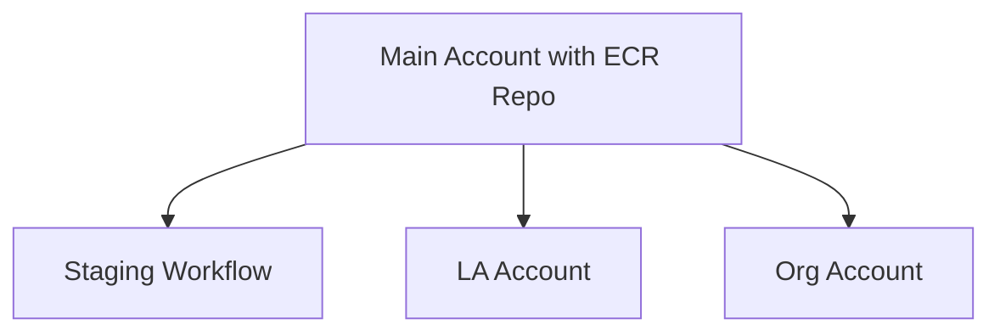

# Infrastructure for Data Platform

The terraform in this directory deploys the SFDATA platform. Currently this is setup for AWS's infrastructure

# Environments
## Dev 
Development is expected to take place locally. To do this, you can either run `dagster dev -f my_pipeline.py` or go 
to the dagster root directory and run the docker compose setup there.  See 
[here](https://docs.dagster.io/guides/running-dagster-locally) for more info about how to 
develop with dagster.

## Staging
Uses the configuration in the stage environment in (./environments/live/stage). 

To Do: Create CI/CD code to auto-deploy this on commit to master

## Prod
Similar to Staging, but for production environments. Could potentially be deployed by using tags for CI/CD
automation. To discuss.

# Components
## ECR
This is where the docker compose setup in the dagster root directory is pushed to. These image repositories
are where the system will pull live images through to subordinate setups.

The idea is to connect all sub accounts to the main one using "organisations" something like this.

Note: This ISN'T how the infrastructure is currently setup, but that's the goal long-term.

## ECS
Each instance of dagster will run on an EC2 image, by default using spot instances which are spare capacity 
that is sold at a cheaper rate to keep costs down. As a lot of these pipelines will not be needed often,
the idea is to scale down to minimum whenever possible and only scale up when needed. Load balancing, etc, is used.
THe idea, however, is that the interface is restricted so that no one can access without using VPN tunnelling. This 
may be removed from the live system to protect data.

## RDS
The database backing Dagster. Defaults to Aurora, but could be changed to others if needed.

## S3
S3 buckets will be used for ingress and egress of data. Also, in the future extra pipeline code might be added
to be brought into the system, but that's a nice to have, not MVP. In the mean time, the pipeline code
exists in the /dagster/sync folder of this repo.

# Deployment Steps
## Main Account
1. Build docker images in /dagster folder: `docker compose build` 
2. Create terraform state s3 bucket in main account
3. Run terraform [TBD] to deploy ECR images. Possibly also HTTPS keys, Route53 records, etc. To Be Determined Later.

## Sub Accounts
1. Only run once Main account is up and running. (may need to store references as configuration)
2. Create state s3 bucket for each sub account
3. Will likely need to modify Main account IAM permissions each time a sub account is added so a secure
handshake between the two will be possible.
4. Run terraform with environment configurations set (e.g. account keys, etc)

# Notes
This configuration is still not up and running. Still to do:

1. Get terragrunt working properly so that multi-environment deployment is possible
2. Test combined setup to make sure it works (proof of concept)
3. Separate main and sub accounts terraform.
4. Bring up separated instances with CI/CD setup
5. Test