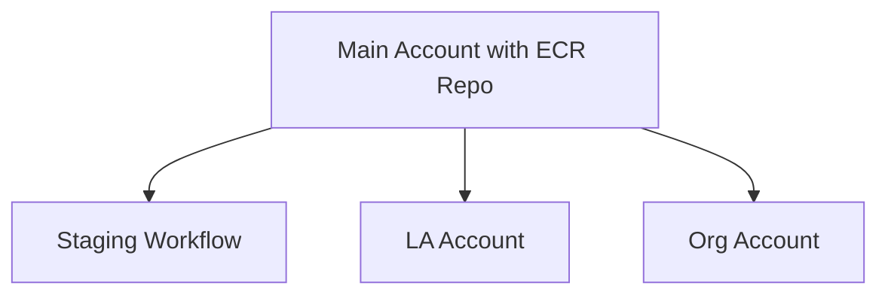

# Infrastructure for Data Platform

The terraform in this directory deploys the SFDATA platform. Currently this is setup for AWS's infrastructure

# Environments
## Development 
Development is expected to take place locally, and not necessarily using the code located here. No infrastructure is 
required. To do this, you can either run `dagster dev -f my_pipeline.py` or go 
to the dagster root directory and run the docker compose setup there.  See 
[here](https://docs.dagster.io/guides/running-dagster-locally) for more info about how to 
develop with dagster.

## Child 
Uses the configuration in the child environment (./environments/child). This is for the standard organisation to use
such as a local authority. It contains the basics needed to run the platform

## Core
Uses the configuration in the stage environment in (./environments/core). This is for the regional organisation to run. 
Connects to the child accounts defined above. Potentially, this can also contain the ECR repositories
that are used across all environments (e.g. Dagster Daemon and Dagit interfaces) and potentially the frontend
of the application itself might be stored here as well (To be determined).

# Components
## ECR
This is where the docker compose setup in the dagster root directory is pushed to. These image repositories
are where the system will pull live images through to subordinate setups. 

The idea is to connect all sub accounts to the main one using "organisations" something like this.

Note: This ISN'T how the infrastructure is currently setup, but that's the goal long-term.

## ECS
Each instance of dagster will run on an ECS task, by default using FARGATE which are spare capacity 
that is sold at a cheaper rate to keep costs down (can be scaled down to zero when not in use). 
As a lot of these pipelines will not be needed often, the idea is to scale down to minimum 
whenever possible and only scale up when needed. Load balancing, etc, is used. The idea, however, 
is that the interface is restricted so that no one can access without using VPN tunnelling. This may 
be removed from the live system to protect data.

## RDS
The database backing Dagster. Defaults to Aurora, but could be changed to others if needed but may have knock-on
effects. Uses Aurora serverless in order to keep costs down using auto scaling. Serverless has the potential to
scale lower than other RDS types. If costs go to high, can switch to a different type as needed.

## S3
S3 buckets will be used for ingress and egress of data. 

# Deployment Steps
## Standard Deployment
1. Load `ecr.yaml` into cloudformation 
2. Create the ECR Repositories
3. Push the correct images [to the ECR Repositories](https://docs.aws.amazon.com/AmazonECR/latest/userguide/docker-push-ecr-image.html)
4. Load `vpc.yaml` into cloudformation
5. Make note of the output values to be used in the next step
6. Load `dagster.yaml` into Cloudformation
7. Create the Dagster setup

# Notes
This configuration is still a work in progress. Still to do:

1. Better secure networking configuration
2. Add in S3 storage for ingress/egress
3. Messaging subsystem
4. Monitoring system
5. Autoscaling triggers to bring the ECS setup to zero tasks and turn back on as needed to keep costs down